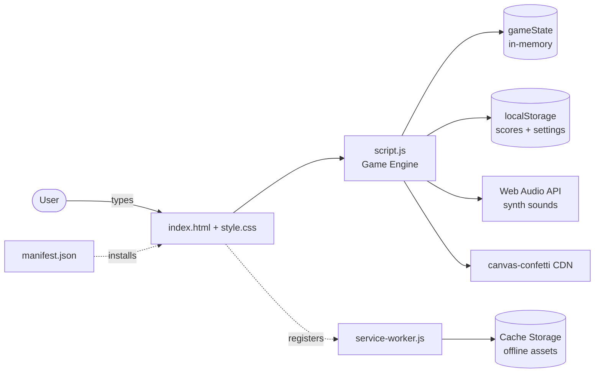

# Type Speed Test — Step-by-Step Build Guide

> **Archived: original build playbook.** This document is the original roadmap used to build the Type Speed Test application from scratch. The codebase may have evolved since this guide was written (for example, the PWA paths, accessibility, and game-end logic were improved later). For current setup, architecture, and deployment notes, see [../README.md](../README.md).

---

> **Project Summary:** Type Speed Test is a framework-free, client-side web application that measures a user's typing speed (WPM) and accuracy. It offers three difficulty levels (easy/medium/hard) and four duration options (30/60/90/120s), provides real-time per-character visual feedback, computes WPM and accuracy live, and celebrates results with a confetti animation. Scores are stored in `localStorage` as the top 10 per level. A dark/light theme and Web Audio API synthesized sound effects can be toggled as preferences. The app is packaged as an offline-capable Progressive Web App (PWA) via a Service Worker and is deployed on GitHub Pages.

Each step below is a self-contained prompt. Execute them in order.

Stack: HTML5, CSS3 (Grid, Flexbox, CSS Variables), Vanilla JavaScript (ES6+), LocalStorage API, Service Worker, Web Audio API, canvas-confetti (CDN).

---

## Table of Contents

**PHASE 1 — Project Foundation**

- STEP 1 — Project Scaffolding & File Structure
- STEP 2 — HTML Layout & Semantic Sections
- STEP 3 — CSS Theming System & Responsive Shell

**PHASE 2 — Core Typing Engine**

- STEP 4 — Text Collections & Game State
- STEP 5 — Game Flow (Start, Restart, Back, End)
- STEP 6 — Real-Time Input Handling & Character Feedback

**PHASE 3 — Stats & Persistence**

- STEP 7 — Timer & Live Statistics (WPM, Accuracy)
- STEP 8 — High Scores with LocalStorage

**PHASE 4 — Experience Layer**

- STEP 9 — Theme & Sound Toggles (Web Audio API)
- STEP 10 — Confetti & Accessibility Polish

**PHASE 5 — PWA & Deploy**

- STEP 11 — Manifest, Icon & Service Worker
- STEP 12 — GitHub Pages Deployment & Community Files

**Appendices**

- Appendix A — Shared Constants & Conventions
- Appendix B — Common Pitfalls
- Appendix C — Pre-Flight Checklist

---

## Global Build Rules (apply to EVERY step)

- **No git operations.** None of the steps in this guide run `git` commands. Version control is handled entirely by the user.
- Do not install unapproved packages. The project uses a single CDN dependency (`canvas-confetti`); do not add others.
- Do not start long-running processes unless requested (a simple static server is sufficient).
- Treat every step as self-contained.
- Prefer native DOM APIs; do not add unnecessary abstraction (DRY and simple code).
- Function and variable names must be in English and camelCase.
- Security, accessibility (a11y), and performance are a priority in every step.

---

## Architecture at a Glance



The application is a single-page (SPA-like) structure: `index.html` hosts three screens (difficulty, game, results) plus a persistent high-scores section. `script.js` keeps all state management in an in-memory `gameState` object; persistent data (scores, theme, sound preference) is written to `localStorage`. There is no server side; the PWA layer is provided by `service-worker.js` + `manifest.json`.

---

# PHASE 1 — PROJECT FOUNDATION

---

## STEP 1 — Project Scaffolding & File Structure

**Goal:** Create the static project skeleton.

**Files/folders to create:**

```
index.html
style.css
script.js
manifest.json
service-worker.js
icons/icon.svg
.gitignore
LICENSE
README.md
```

**Implementation notes:**

- No build step, bundler, or `node_modules`. Pure static files that run directly in the browser.
- A simple static server is enough for development (e.g., `python -m http.server 8000`). The Service Worker does not run over `file://`; always test over `http://`.

**Acceptance:** An empty `index.html` opens in the browser and the four core files (`html/css/js` + `manifest`) reference each other.

---

## STEP 2 — HTML Layout & Semantic Sections

**Goal:** Mark up all screens in a semantic and accessible way.

**Files to edit:** `index.html`

**Implementation notes:**

- Four logical regions inside a single `.container`:
  - `header` — title, subtitle, theme and sound toggle buttons in the top right.
  - `#difficultySection` — difficulty cards (`data-level`) + duration buttons (`data-duration`).
  - `#gameSection` (`.hidden` initially) — stats bar, `#textDisplay`, `#textInput` textarea, action buttons.
  - `#resultsSection` (`.hidden`) — WPM, accuracy, total characters, error cards.
  - `#highscoresSection` — level tabs + score list.
- Give buttons and icons an `aria-label`. Icons are embedded as inline SVG (`stroke="currentColor"`); no external icon library.
- For the `textarea`, set `autocomplete/autocorrect/autocapitalize="off"` and `spellcheck="false"`.
- For accessibility, add a visually hidden `<label for="textInput">` tied to the textarea, and `aria-live="polite"` on the live-updating stat values.

**Acceptance:** All sections exist in the DOM; initially only difficulty and high-scores are visible, with game/results hidden.

---

## STEP 3 — CSS Theming System & Responsive Shell

**Goal:** A theming system using CSS variables and a responsive layout.

**Files to edit:** `style.css`

**Implementation notes:**

- Define dark theme (default) variables in `:root` and light theme variables in `[data-theme="light"]`: colors, `--border-radius*`, `--shadow*`, `--transition`.
- Use CSS Grid for layout (cards, stats, results) and Flexbox (buttons, header-top).
- `@keyframes` for `fadeIn`, `slideUp`, and `blink` (active character cursor) animations.
- Responsive breakpoints: `768px` and `480px`. On mobile, collapse grids to a single column and make header-top static.
- Use a `print` media query to hide buttons/footer.
- Utility classes: `.hidden { display:none !important }` and `.visually-hidden` (a label invisible to sighted users but read by screen readers).

**Acceptance:** Theme variables apply; the layout collapses to a single column when the window is narrowed.

---

# PHASE 2 — CORE TYPING ENGINE

---

## STEP 4 — Text Collections & Game State

**Goal:** Define the content pool and the central state object.

**Files to edit:** `script.js`

**Implementation notes:**

- `textCollections` object: sentence arrays under the `easy`, `medium`, and `hard` keys.
- The `gameState` object holds all runtime state:

```javascript
let gameState = {
    currentLevel: null,
    currentText: "",
    startTime: null,
    endTime: null,
    timerInterval: null,
    timeLeft: 60,
    selectedDuration: 60,
    isGameActive: false,
    typedChars: 0,
    correctChars: 0,
    incorrectChars: 0,
    currentIndex: 0
};
```

- `appSettings` object: `{ theme, soundEnabled }`.
- Capture DOM references once at the top of the file via `getElementById` / `querySelectorAll` (to avoid re-querying — performance).

**Acceptance:** `textCollections` and `gameState` are reachable from the console; random text selection works.

---

## STEP 5 — Game Flow (Start, Restart, Back, End)

**Goal:** Screen transitions and the game lifecycle.

**Files to edit:** `script.js`

**Implementation notes:**

- `startGame(level)`: set level + random text, reset `gameState`, hide difficulty/results, show game, call `renderText()`, clear and focus the textarea.
- `resetGameState()`: reset the timer and character counters; clear any existing `timerInterval` with `clearInterval`.
- `restartGame()` → `startGame` with the same level. `backToMenu()` → hide game/results, show difficulty, clear the timer.
- `endGame()`: set `isGameActive=false`, record `endTime`, disable the input, clear the timer, compute final stats, save the score, show the results screen, trigger the success sound + confetti.

**Acceptance:** Selecting a difficulty starts the game; restart/menu/try-again buttons make the correct screen transitions.

---

## STEP 6 — Real-Time Input Handling & Character Feedback

**Goal:** Validate and color each typed character instantly.

**Files to edit:** `script.js`

**Implementation notes:**

- `renderText()`: render each character as a separate `<span class="char" data-index>` into `#textDisplay`.
- `handleInput(e)`:
  - On the first input, start the timer and set `startTime`.
  - Clear the `correct/incorrect/current` classes from all spans, then compare against the input and re-mark them.
  - Count correct/incorrect characters; give the next character to type the `current` class.
  - If a new last character was added, play the `keypress` or `error` sound.
  - Prevent pasting: `textInput.addEventListener('paste', e => e.preventDefault())` (anti-cheat).
- **Important improvement:** End the game when the entire text has been typed — even if there are incorrect characters (`inputLength >= currentText.length`). Otherwise a user who completes the whole text with errors stays stuck until the timer runs out.

**Acceptance:** Correct characters turn green, incorrect ones red; completing the text transitions to the results screen.

---

# PHASE 3 — STATS & PERSISTENCE

---

## STEP 7 — Timer & Live Statistics (WPM, Accuracy)

**Goal:** Countdown and live metrics.

**Files to edit:** `script.js`

**Implementation notes:**

- `startTimer()`: use `setInterval` to decrement `timeLeft` each second. Call `updateStats()` on every tick (so WPM/accuracy update even if the user stops typing). When `timeLeft <= 0`, call `endGame()`.
- WPM formula (standard: 5 characters = 1 word):

```javascript
const wordsTyped = correctChars / 5;
const elapsedMinutes = (Date.now() - startTime) / 60000;
const wpm = elapsedMinutes > 0 ? Math.round(wordsTyped / elapsedMinutes) : 0;
```

- Accuracy: `Math.round((correctChars / typedChars) * 100)`; `100` if nothing has been typed.
- `calculateFinalStats()` writes the `finalWpm` and `finalAccuracy` values into `gameState` for the results screen.

**Acceptance:** The countdown decrements correctly; WPM and accuracy update every second both while typing and while idle.

---

## STEP 8 — High Scores with LocalStorage

**Goal:** Persist and list scores.

**Files to edit:** `script.js`

**Implementation notes:**

- `saveScore()`: create a new score object (`wpm, accuracy, correctChars, incorrectChars, level, duration, date, timestamp`), add it to existing scores, sort by WPM (then accuracy) descending, keep the top 10 for the relevant level, and write to `localStorage`.
- `getScores()` / `getScoresByLevel(level)`: JSON parse + filter + sort + `slice(0, 10)`.
- `displayHighscores(scores)`: show a "No scores yet" message when empty; when populated, render each score with rank, WPM, accuracy, correct, errors, and date.
- `switchHighscoreTab(level)`: update the active tab and load the relevant scores.
- Key names: `typeSpeedScores`, `typeSpeedTheme`, `typeSpeedSound`.

**Acceptance:** When a test ends the score is saved and appears sorted in the correct tab; it persists across page reloads.

---

# PHASE 4 — EXPERIENCE LAYER

---

## STEP 9 — Theme & Sound Toggles (Web Audio API)

**Goal:** Theme and sound preferences + synthesized sound effects.

**Files to edit:** `script.js`

**Implementation notes:**

- `loadSettings()/saveSettings()`: read/write preferences from `localStorage`. `applyTheme()` sets the `data-theme` attribute and swaps the icons.
- `toggleTheme()` and `toggleSound()` update state + icon + storage.
- Sound: no external files. Create an `AudioContext` (with webkit fallback) via `initAudioContext()`; `playSound(type)` produces an `OscillatorNode` + `GainNode`.
  - `keypress` (800Hz sine), `error` (200Hz square), `click` (600Hz), `success` (C5→E5→G5 arpeggio).
- The `AudioContext` is started only on the first user interaction (browser autoplay policy).

**Acceptance:** Theme and sound state persist across reloads; sounds play on click/error/success.

---

## STEP 10 — Confetti & Accessibility Polish

**Goal:** Celebration effect and accessibility touches.

**Files to edit:** `index.html`, `script.js`, `style.css`

**Implementation notes:**

- Add `canvas-confetti` from a CDN; `triggerConfetti()` fires three bursts (center, left, right). Call it safely with a `typeof confetti === 'undefined'` check.
- a11y: a `.visually-hidden` label for the textarea, `aria-live` on stat values, `aria-label` on buttons.
- Choose theme variables that meet WCAG contrast requirements.

**Acceptance:** Confetti fires when a test finishes successfully; screen readers announce stat updates.

---

# PHASE 5 — PWA & DEPLOY

---

## STEP 11 — Manifest, Icon & Service Worker

**Goal:** Make the app an installable, offline-capable PWA.

**Files to edit:** `manifest.json`, `service-worker.js`, `icons/icon.svg`, `index.html`, `script.js`

**Implementation notes:**

- `manifest.json`: `name`, `short_name`, `description`, `display: standalone`, theme/background colors, icon(s). A single SVG icon (`image/svg+xml`, `sizes: "any"`) covers all sizes with one file.
- **GitHub Pages compatibility (critical):** Because the site is deployed under a subdirectory, keep all paths **relative**. In `manifest.json` use `start_url: "./"` and `scope: "./"`; register the Service Worker with `navigator.serviceWorker.register('./service-worker.js')`; provide the cache list as `./index.html`, `./style.css`, `./script.js`, `./manifest.json`, `./icons/icon.svg`. Absolute (`/`) paths 404 under a subdirectory.
- `service-worker.js`: `install` → cache assets; `activate` → clean old caches; `fetch` → cache-first, network fallback, `./index.html` when offline. Version the cache name (`...-v2`) so old caches are cleared on update.
- `index.html`: `<link rel="manifest">`, `theme-color`, apple meta tags, and `rel="icon"` and `apple-touch-icon` must point to the SVG.

**Acceptance:** Lighthouse PWA criteria pass; the app is installable and opens offline; the console shows no 404s.

---

## STEP 12 — GitHub Pages Deployment & Community Files

**Goal:** Deployment and repository health files.

**Files to edit:** `.github/`, `README.md`

**Implementation notes:**

- Deploy GitHub Pages from the `main` branch / root directory in the repo settings. Demo URL: `https://<user>.github.io/<repo>/`.
- Keep community health files under `.github/` (GitHub detects them automatically): `CONTRIBUTING.md`, `CODE_OF_CONDUCT.md`, `SECURITY.md`, `PULL_REQUEST_TEMPLATE.md`, `ISSUE_TEMPLATE/` (bug_report.yml, feature_request.yml, config.yml).
- Point the security link in `config.yml` to the `.../security/policy` URL.
- In the README, make sure the repository name, demo link, clone URL, and issue links all match the current repository name.

**Acceptance:** The demo is live; the repo "Community Standards" are green; issue templates appear in the GitHub UI.

---

# Appendix A — Shared Constants & Conventions

- **LocalStorage keys:** `typeSpeedScores`, `typeSpeedTheme`, `typeSpeedSound`.
- **WPM standard:** 5 characters = 1 word.
- **Duration options:** 30 / 60 / 90 / 120 seconds (`data-duration`).
- **Difficulty levels:** `easy` / `medium` / `hard` (`data-level`).
- **Score limit:** Top 10 per level.
- **Naming:** English, camelCase functions/variables; kebab-case CSS classes.
- **Section visibility:** Managed via the `.hidden` class.

---

# Appendix B — Common Pitfalls

- **Absolute paths:** `/...` paths break under the GitHub Pages subdirectory; always use `./...`.
- **Service Worker over `file://`:** The SW only registers over `http(s)://`; do not test by opening the file directly.
- **SW cache staleness:** When assets change, version the cache name (`-v2`) or a hard refresh (Ctrl+Shift+R) is required.
- **AudioContext autoplay:** Do not start the context before the first user interaction, otherwise the browser blocks it.
- **Missing icon references:** References to non-existent PNGs in the manifest produce 404s; use the existing SVG.
- **Game-end condition:** If tied to a "zero errors" requirement, the game hangs on an all-incorrect completion; end based on length.

---

# Appendix C — Pre-Flight Checklist

- [ ] The three screens (difficulty/game/results) transition correctly.
- [ ] WPM and accuracy update both while typing and while idle.
- [ ] Correct/incorrect character coloring works.
- [ ] Scores are saved, sorted, and persist across reloads.
- [ ] Theme and sound preferences persist.
- [ ] Pasting is prevented.
- [ ] Manifest + SW work with relative paths; the app opens offline.
- [ ] No 404s / errors in the console.
- [ ] The app is keyboard-navigable; aria labels are present.
- [ ] Mobile (480px) and tablet (768px) layouts do not break.
